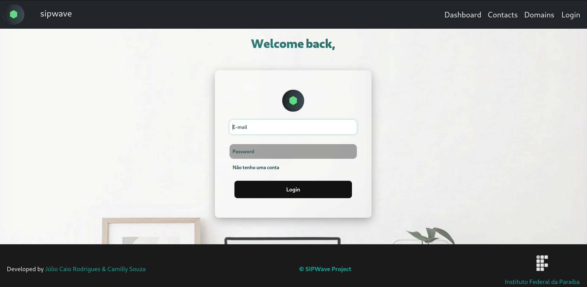

<h1 align="center">SIPWave Project</h1>

Hello, Dev! How are things going? Have you had your little coffee today?

**SIPWave is a web application designed to facilitate the creation and management of SIP-based communication systems, such as IP PBX solutions, VoIP gateways, and conference servers.**

 

 

## Pages:

- [Home](https://camillypsouza.github.io/SIPWave-IFPB-DW/public/pages/homepage/)
- [Register](https://camillypsouza.github.io/SIPWave-IFPB-DW/public/pages/register/)
- [Login](https://camillypsouza.github.io/SIPWave-IFPB-DW/public/pages/login/)
- [Domains](https://camillypsouza.github.io/SIPWave-IFPB-DW/public/pages/domain_sip/)

## Features:

1. **SIP Domain Registration:**
   - The system allows users to register and manage SIP domains, which are essential for configuring communication connections within the VoIP network. This feature makes it easier to manage multiple domains, routing calls, and authenticating SIP devices.

2. **VoIP Calling:**
   - The application provides features for making SIP-based VoIP calls, allowing users to initiate, receive, and manage calls in real-time with high audio quality directly from the app interface.

3. **Call Queue Management:**
   - The application also offers tools to create and manage call queues, ensuring that incoming calls are distributed efficiently among attendants. This feature is crucial for businesses that require a structured customer service system.

## Technologies Used:

## Authors

<a href="https://github.com/Julio-Caio"><b>Júlio Caio</b></a>

 

<a href="https://github.com/camillypsouza"><b>Camilly Souza</b></a>

 