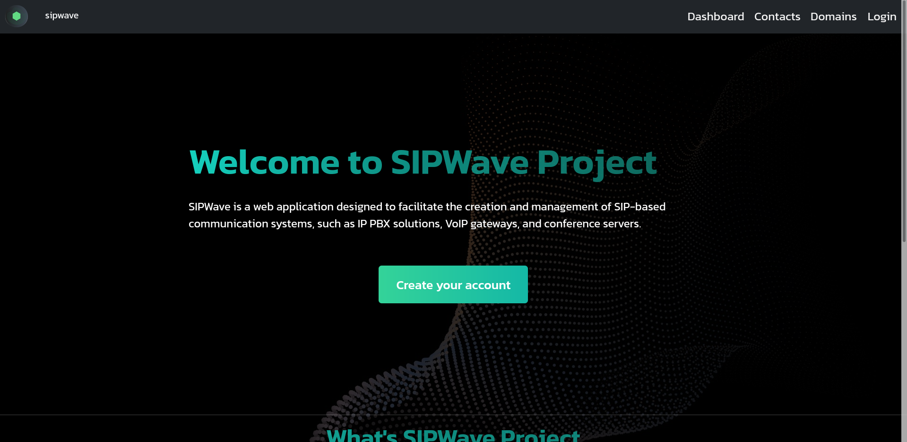
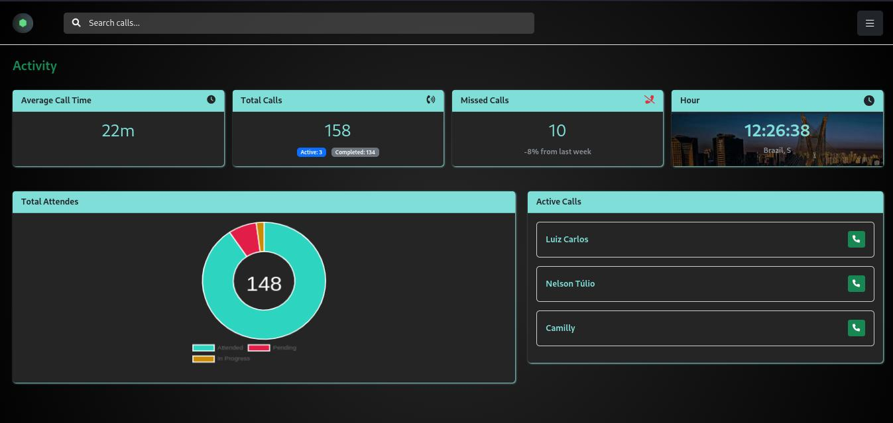

<h1 align="center">SIPWave Project</h1>

Hello, Dev! How are things going? Have you had your little coffee today?

**SIPWave is a web application designed to facilitate the creation and management of SIP-based communication systems, such as IP PBX solutions, VoIP gateways, and conference servers.**

## Pages:

- [Home](https://Julio-Caio.github.io/SIPWave-IFPB-DW/public/index.html)

<br>
<center></center>
<br>
<center></center>

<center></center>

## Features:

1. **SIP Domain Registration:**
   - The system allows users to register and manage SIP domains, which are essential for configuring communication connections within the VoIP network. This feature makes it easier to manage multiple domains, routing calls, and authenticating SIP devices.

2. **VoIP Calling: (In development)**
   - The application provides features for making SIP-based VoIP calls, allowing users to initiate, receive, and manage calls in real-time with high audio quality directly from the app interface.

3. **Call Queue Management: (In development)**
   - The application also offers tools to create and manage call queues, ensuring that incoming calls are distributed efficiently among attendants. This feature is crucial for businesses that require a structured customer service system.

## Technologies Used:

<div style="display: inline-block">


</div>

## Authors

<a href="https://github.com/Julio-Caio"><b>Júlio Caio</b></a>

[](https://www.linkedin.com/in/julio-caio-r-santos) [](mailto:caio.julio@academico.ifpb.edu.br)

Claro! Aqui está o trecho do `README.md` traduzido para o inglês com os comandos em bash organizados passo a passo:

---

### 📦 Getting Started

1. **Set your environment variables**

   First, define your environment variables by either creating a new `.env` file or renaming the provided `.env.example` file:

   ```bash
   cp .env.example .env
   ```

   Then, edit the `.env` file to customize the variables according to your environment.

2. **Start the containers**

   In the project root directory, run the following command to build and start the containers:

   ```bash
   docker-compose up -d --build
   ```

   This will spin up two containers:
   - **PostgreSQL**: used to store user data, domains, and extensions.
   - **Asterisk**: where we will later implement features for handling calls and managing active calls via the dashboard.

   Make sure both containers are running correctly.

3. **Install project dependencies**

   Next, install all the required dependencies:

   ```bash
   npm install
   ```

4. **Apply database migrations**

   Go to the `src/` directory and run the following command to generate the database tables using Prisma:

   ```bash
   cd src/
   npx prisma migrate dev
   ```

   ⚠️ Make sure there are no errors during this process.

5. **Start the development server**

   Finally, run the development server:

   ```bash
   npm run dev
   ```

---